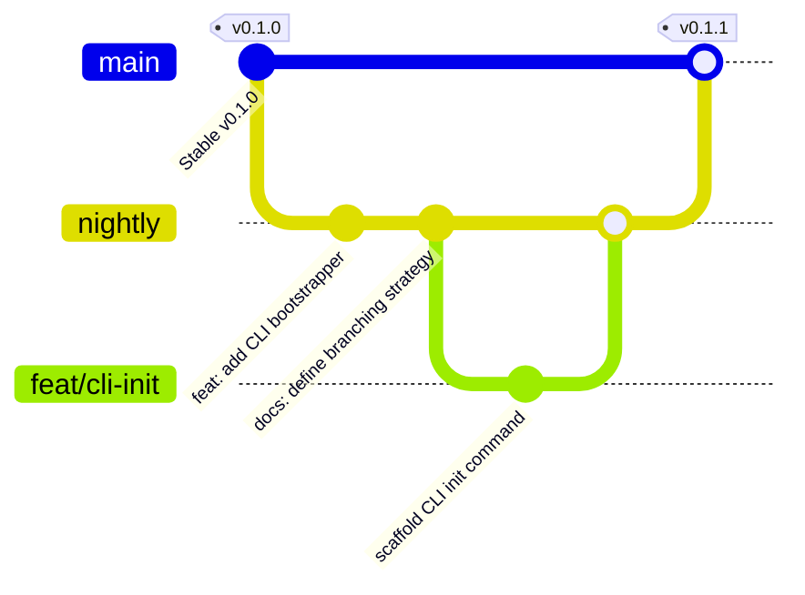

# Git Branching Strategy — spellbookx

## Overview

This document outlines the branching model adopted for the `spellbookx` organization repositories, based on a hybrid of [Git Flow](https://nvie.com/posts/a-successful-git-branching-model/) and the [Conventional Branch Naming Standard](https://conventional-branch.github.io).

---

## Branch Types

| Branch Name         | Purpose                                              | Naming Convention                  |
|---------------------|------------------------------------------------------|------------------------------------|
| `main`              | Latest **stable** production-ready release           | _Protected_                        |
| `nightly`           | Rolling WIP, all current dev work targeting `main`   | _Protected_                        |
| `dev/*`             | Feature bootstrapping, scaffolding, or prep work     | `dev/<scope>`                      |
| `feat/*`            | New features                                         | `feat/<scope>`                     |
| `fix/*`             | Bug fixes                                            | `fix/<scope>`                      |
| `chore/*`           | Infra, tooling, maintenance                          | `chore/<scope>`                    |
| `docs/*`            | Documentation only changes                           | `docs/<scope>`                     |
| `refactor/*`        | Code restructuring (no new features/fixes)           | `refactor/<scope>`                 |
| `test/*`            | Tests and test coverage                              | `test/<scope>`                     |
| `ci/*`, `build/*`   | CI/CD configuration and build tasks                  | `ci/<provider>`, `build/<scope>`   |

---

## Merge Rules

- Only `main` and `nightly` are long-lived.
- All feature branches should be branched off from `nightly`.
- PRs to `main` should **only** originate from `nightly`.
- Fast-forward merges are disabled. Use `merge --no-ff` or squash commits.
- All commits must comply with [Conventional Commits](https://www.conventionalcommits.org).

---

## Commit Messages

Use the VSCode extension [`vivaxy.vscode-conventional-commits`](https://marketplace.visualstudio.com/items?itemName=vivaxy.vscode-conventional-commits) or CLI tools like `commitizen` or `git cz` to enforce commit hygiene.

---

## Branch Lifecycle

---

## Notes

- Always rebase onto `nightly` before merging into it.
- Never force-push to `main` or `nightly`.
- Use draft PRs for early feedback.
- Link issues using `fixes #<issue>` or `closes #<issue>`.
